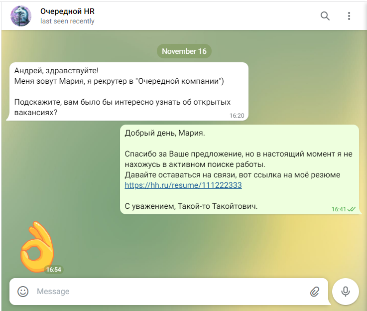

# HrAnswer

Get personalized answer in 2 clicks for messages from HRs.

## How to install (Windows only)

- Clone this repository
- Build project locally with command `dotnet build -c Release`
- Add path to binaris in environment PATH variable

## How to use

- When you receive another message from HR, copy his/her name to clipboard
- Press Win-R (to open Run dialog)

- Run HrAnswer app and paste HR's name
- The personalized answer is placed in clipboard, and you can just paste it into messenger in order to send your answer to HR
